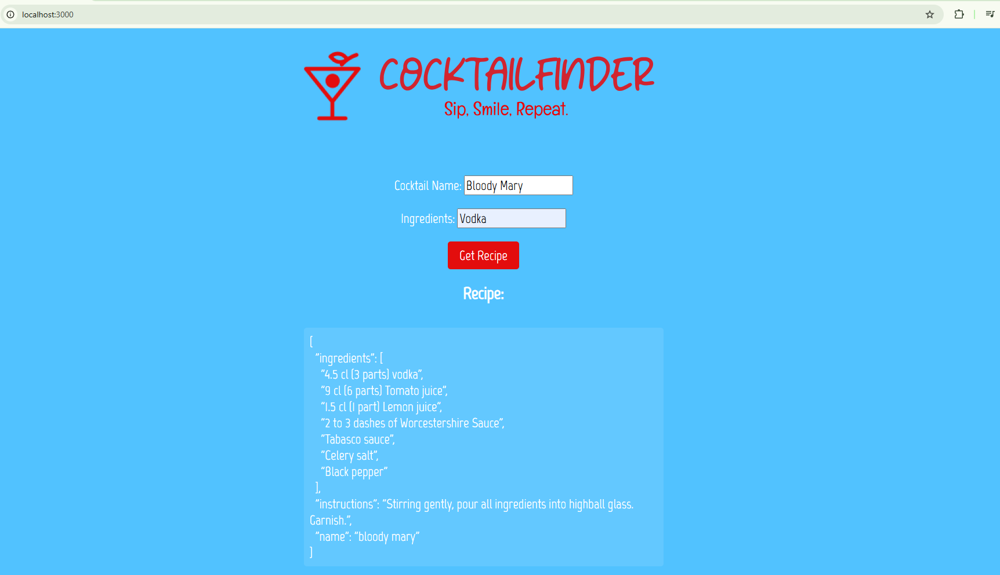

# 🍹 CocktailFinder

**Sip, Smile, Repeat.**

CocktailFinder is a simple **Node.js + Express** application that lets users search for cocktail recipes by providing a cocktail name and ingredients.  
The backend fetches real-time data from the **API-Ninjas Cocktail API** and returns matching recipes.

## 📸 Screenshot



## 🚀 Project Overview

Users can:

- Enter a **cocktail name**
- Provide one or more **ingredients**
- Instantly receive a matching cocktail recipe

This project demonstrates:

- Building a lightweight **Express API**
- Consuming a **third-party REST API**
- Connecting a backend service to a simple frontend

## 🛠️ Tech Stack

- **Node.js**
- **Express.js**
- **Axios**
- **dotenv**
- **HTML / CSS / JavaScript**
- **API-Ninjas Cocktail API**

---

## 📦 Installation & Setup

### 1️⃣ Clone the repository

```bash
git clone https://github.com/wild-butterfly/cocktailfinder
cd cocktailfinder

2️⃣ Install dependencies

npm install

🔑 API Key Configuration

This project uses the API-Ninjas Cocktail API.

Visit https://api-ninjas.com

Create a free account

Copy your API key

Create a .env file in the project root:

API_KEY=YOUR_API_KEY_HERE


The .env file is excluded from version control for security.

▶️ Running the Application

Start the server:

node app.js


Then open your browser at:

http://localhost:3000

🎯 Internal API Endpoint

The frontend communicates with the backend using:

GET /api/cocktail?name=NAME&ingredients=INGREDIENTS


Example:

GET /api/cocktail?name=Margarita&ingredients=Tequila

📂 Project Structure
cocktailfinder/
├── app.js
├── public/
│   ├── index.html
│   ├── logo.png
│   └── screenshot.png
├── .env
├── package.json
└── README.md

❗ Error Handling
The API may return:

400 – Missing name or ingredients

404 – Cocktail not found

500 – External API or server error

User-friendly error messages are displayed in the UI.

## 🌐 Live Demo
This project uses a Node.js + Express backend and relies on a third-party API.
For security and API usage reasons, it is not deployed publicly.

The application is intended to be run locally.

🤝 Contributing
Suggestions, issues, and pull requests are welcome.
```
